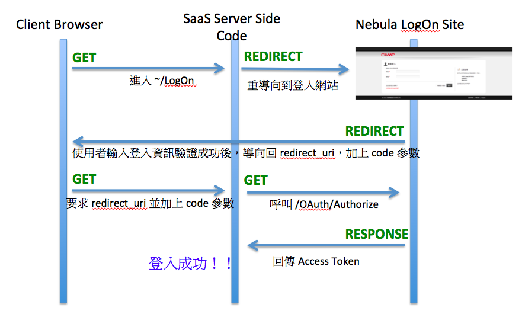

Nebula Login
================

The current login authentication Nebula 2.0 supports is [OAuth 2.0](http://oauth.net/2/). With it and some simple settings, you can easily use [CAMP](http://www.quanta-camp.com) portal accounts to provide user login authentication.

OAuth2 Login Techniques and Flow Description
----------------



## Login Authentication

If you want to integrate with [CAMP](http://www.quanta-camp.com) portal login accounts, you can use the following two steps to setup.

## Nebula SDK
----------------

In Nebula SDK, for Asp.Net Mvc 2/3/4, there is provided a [Nebula.Web.Security](dotnet/Nebula.Security.md) of Nuget Package.  
For Asp.Net Mvc5, there is provided a [Nebula.Web.Identity](#dotnet/Nebula.Web.Identity.md) of Nuget Package.  
After installation, you can simple to do integration with [CAMP](http://www.quanta-camp.com) Account

## Using Web Service
----------------

[OAuth 2.0](http://oauth.net/2/) specification is publicly available. Developers can also implement their own do OAuth2 do authentication, or to verify the use of the familiar Framework

### OAuth 2.0 Role Definition

* **Resource Owner** - Authorize others to access Protected Resource. If this role is human, then refers to the user (end-user).
* **Resource Server** - Protected Resource server storage, according to Access Token to accept the request of Protected Resource.
* **Client** - Resource Owner representatives to access Protected Resource applications. "Client" The term does not refer to any specific implementations (above can be run in Server, running on a general computer, or other device).
* **Authorization Server** - In authenticated Resource Owner and Resource Owner license after issuance Access Token server.

In CAMP, our Resource Server and Authorization Server is the same set of servers.

Server Url is https://www.quanta-camp.com/OpenId/

### OAuth basic flow

The following is an overview of the process of abstraction, to compare the macro point of view to describe the process than the actual operation of the program (Figure by Spec in Figure 1)

```
+--------+                               +---------------+
|        |--(A)- Authorization Request ->|   Resource    |
|        |                               |     Owner     |
|        |<-(B)-- Authorization Grant ---|               |
|        |                               +---------------+
|        |
|        |                               +---------------+
|        |--(C)-- Authorization Grant -->| Authorization |
| Client |                               |     Server    |
|        |<-(D)----- Access Token -------|               |
|        |                               +---------------+
|        |
|        |                               +---------------+
|        |--(E)----- Access Token ------>|    Resource   |
|        |                               |     Server    |
|        |<-(F)--- Protected Resource ---|               |
+--------+                               +---------------+

                Figure 1: Abstract Protocol Flow
```

### Process implementation 

-----
####  1. User login and authorization (Authorization Code Flow)

This step is required by the HTTP call from Client-side redirect to the Authorization Endpoint Authorization Server's.
If the user is not logged in, a login screen will be displayed to the user login. If you have logged in, the way will be HTTP 302 redirect back to the redirect_uri parameter defined

Return data, using GET method call redirec_uri, parameters will be passed QueryString way.  
The following URL is a relative URL https://www.quanta-camp.com/OpenId/  

##### URI

**GET OAuth/Authorize**

##### Parameter

Parameter Name | Necessary/Optional | Content Value Meaning
 --- | --- | --- 
 client_id | Necessary | Product ID <br/> Please apply for a CAMP products, obtain product code and verification code.
redirect_uri | Necessary | After logon authentication, HTTP 302 redirect back to the SaaS website.
response_type | Necessary | 'code'
state | Necessary | Generic parameters used to maintain the initial state. Can define.
scope | Necessary | Generic parameter is used to specify the scope of access to resources.<br/> Please refer to the bottom of the resource site<br/>(URL Please pass the full URL, non-relative URLs).

##### Response

Code Sample：  
```
http://localhost/?code=Q8TJ%21IAAAAE9k7bl81oIIlqLW5wxZ3pcYHUziL86uB6NKizoCGKscIQEAAAEcjOnigP_pqgfWrUe2d8sug6tK_pmKVVs4x8xIQfsB-6Pw8uy5nuB_XYoQqiC3Fex7wmOo0qufNlQIZKTL8KmyAXNQFbTP4Dqun-Jsgy481yN1Yvkyb6bn1-49KScZ0T0Ycs8k_iZ15A9M1LscgIPrsqw3wbqbLvX_THg_d2OytF3INGTV5Df8wd_HpR27-MIuf7FR0cPBMaXsb8JTMkgzbGYH2uNc0KqXOwK6bo7F0GjzXZDujB4J7_6MHYFnV5IgQxLG0gPmI3ieiNEqA75E2WBVhX0mF9FH_im3JWfDrO1DUczmlufZqQcTOUzgBbl9viE75KgAn3YJIynCMQLLY9NAosxXhTh-Ue26GcaWl7OnbOMGkvk8ZQ5rk1X1VCE&state=abc
```

Parameter Name | Meaning 
 --- | --- 
code | Authorization Code
state | State value. Service will return the parameters passed state data.

-----
####  2. Get Access Token

After the SaaS service to obtain Authorization Code by the previous step, you need to get Access Token, the user can access the Resource obtain relevant information.

##### URI

**POST OAuth/Token**

##### Authentication

HTTP BASIC authentication, account for the **productId**, password for **Authorization Code**

##### Header

Name | Value 
 --- | --- 
Content-Type | application/x-www-form-urlencoded
Accept | application/json

##### Parameter

Name | Value 
 --- | --- 
code | Please pass the previous step to obtain the Authorization Code.
redirect_uri | Please enter the same URI with the first step.
state | Please enter the same state with the first step.
grant_type | 'authorization_code'

##### Response

HTTP 200 - OK
```javascript
{
    "access_token": "gAAAAG8vXEjz0VLsCVKHyjI4VBtfYklR_JwuH8S9QA0LkgGDTKSx7pvDG-eQ5WTeCSAWcHOeA8Ga3hK-_2KARznZq-4ZmaKh9m_GCjEoApBzhXeMXxo3L_KX9zrf7C8f4yXZu_crc6jNh1z98P1jytZvlXReHjXP0TYEDjQ71UfO5LC-RAEAAIAAAAChxEYuF1MMYdw5rauytPVWuF8IMx95-d6TqJ_5yaLWqUs3wxnQsnEMLKaXCDOmVpfm9gM4yMJUce_RiFXpOU4FPlmYlRMKKfug1ANnWLS2L9IW1XxsYH_Us1PArHBl7UuM_Zlke0Qa4Luwu1SrQxwUJ-OqhHsswOgQKu3PKXVSHvMBK5XX5RkUj491fDFaVQIXRWBbg0c7WEdO5vwJRbU6NaXIYryCHH6m6jbRAL6B7cerHhkC_RlkwVd6Ll6tjWlHKCUQNXUavIcl2INcvYDp7pYrZB4Ied7q5XG3Syy5xiw7mhVdA14ffeFDP3YWU0sixV_0hsJhCv3v84XjHobJ7fSkAwq_dSQ3knVJz4Ecykzlz_Eb84x5Oav3Cjg0nLSGg5gh74pmw5YlQmZzTVlSxLZpmQmEoJkv_VYUfA4dzg",
    "token_type": "bearer",
    "expires_in": 120,
    "refresh_token": "IOsJ!IAAAAPYdtDryZUvKpAPMl_l9x9p5dUZYiCtyEIvQP_-4S1M64QAAAAEgUaowK9ms3viCp_8g_j-4XqMAB4hE9Z996Ib5TUplGNuE-3a0LRWTE23Az2kdIR0--lOOm2MA9xwIncln180WcRpEeXvC_QIHvJCoocNbAN2sxzEI2wRjlmkXdKXiwAGSoKWRJkdthI7O2JrhvOFjhcEDxsnroRTA2VtEr6VR6sEZgJ2s3GsmwDWWDNiElCnuuu6hRy4mB0Gh_9j3-sm9GJz8eaecp-sVQqtwtrmBIYT97ydj-Upm_4vNOpU2G8dlEYyjmieELZs1OG3oxmWFuWXdDohpySZpygbtGPYp_Q",
    "scope": "http://www.quanta-camp.com/OpenId/Profile/UserIdentity"
}
```

Parameter Name | Meaning 
 --- | --- 
access_token | Access Token. Resource access the necessary parameters<br/>save yourself.
token_type | 'bearer'
expires_in |  Token Effective time, unit: seconds.
refresh_token | Token update the necessary parameters<br/>Save yourself.
scope | The first step requires the return of the original scope data

-----
####  3. Access to resources

In CAMP, we offer the following three Resource 

Ways to access resources through System.Net.WebRequest or any HTTP Client calls.  

-----
##### User login account

###### URI 
**GET Profile/UserIdentity**  

###### Header

Name | Value 
 --- | --- 
Authorization | 'Bearer ' + Access Token

###### RESPONSE
HTTP 200 - OK
```javascript
{
    "UserId": "User login account"
}
```

-----
##### User Information

###### URI 
**GET Profile/UserInfo**  

###### Header

Name | Value 
 --- | --- 
Authorization | 'Bearer ' + Access Token

###### RESPONSE
HTTP 200 - OK
```javascript
{
    "UserId": "User login account",
    "Name": "User name",
    "EnglishName": "User english name",
    "Email": "email",
    "CompanyId": "company code"
}
```
  
-----
##### Company information

###### URI 
**GET Profile/CompanyInfo**  

###### Header

Name | Value 
 --- | --- 
Authorization | 'Bearer ' + Access Token

###### RESPONSE
HTTP 200 - OK
```javascript
{
    "CompanyId": "Company Code",
    "Name": "Company name"
}
```

-----
####  4. Refresh Token

When the Access Token expired, need to get a new Access Token.

##### URI

**GET OAuth/Token**

##### Authentication

HTTP BASIC authentication, account for the **productId**, password for **Authorization Code**

##### Header

Name | Value 
 --- | --- 
code | Please pass Step 2 obtained Refresh Token.
grant_type | 'refresh_token'

##### Response

HTTP 200 - OK
```javascript
{
    "access_token": "gAAAAEliWLz7kqoeuL_KMPChLXF6OHpo-hAnuDsC_NrrntzG7zO6nuEAWCxn6yCGL5huH3vKP1Jfwj7FovifZFdzOpB4TCfQxaHWSyZI1RChGzLH0jVJqsVKCnNkpKbyN0GvZWddQCB6lp8NxGL8tw32c6g7_4edzlGwmiWMTdNMZgOcRAEAAIAAAABwVbUFrTrdUcrqHSiwkr3bZqiSExr1w_x1qkVr5Wc9SvcxZpVrN9Jjy_B9o4U2xam8FfbfVshSbqit1RvhW6nbUDoci_fad9nUc0p1um15qncwsxYvJfGSgIoHOl3pQ4RhVmgNw0SXU0EUHHiFQe6RQ8Vt3fLnqe1h4Hdjb69kyq6QyNowcf3kKEuNq77HqWRMXvS7MxkTq6nd7IQ22vwGjnk7_ZCrjbfPC85j3RRCHznHs-clUEWzT0pd3Xlmq_APodCrzVE9CU44uiheMOV9ZM3kNcCvK5-SsVgnn3Ob0666t6cED9NFii1wxVxQE5FPOrBwaRp-WxTYQOeSGSkiHVxCtR6PwOTTqqV8NGhG-QTv-Hg_lhCcExtDcgoejiEVBEBFv1WzTYZ86iqRr5iVYaC1F5ukaGTdAlgF_PGYog",
    "token_type": "bearer",
    "expires_in": 120,
    "refresh_token": "IOsJ!IAAAAEzZQuV-F65rxc-6pti9iQMOKkQoYzD7ptYJkWEQ_cEA4QAAAAE-qTl-bvIzRbiGO7RMvikPQKCwS1wbaMjWL6WPTEv0TVaM_5hLojzXRV6vG98CxQPM7gVNvtiz-fcr9TINqtG5k5fgkr9egPjEgvLhIE4JlRO0UHBo9UJyxyXGQhTR3cJvlzcX_K2y4oLL1dqWK1beD0kWwqoz1KEbZJwLrTH53UUz6FCf0rw7OJ-W8FP5-PPV-LN95LHCQxZ_U7-G9RefZxuGXIE1Ih1rRyn4LMmMivv9AKM9e3ckyFFdrup_UYvCrm4lk5pzwDnnuQXA_har9Uj_l3IBZMEgj0MgoPE2ZA",
    "scope": "http://www.quanta-camp.com/OpenId/Profile/UserIdentity"
}
```

Parameter Name | Meaning 
 --- | --- 
access_token | Access Token. Resource access the necessary parameters<br/>save yourself.
token_type | 'bearer'
expires_in |  Token Effective time, unit: seconds.
refresh_token | Token update the necessary parameters<br/>Save yourself.
scope | The first step requires the return of the original scope data
