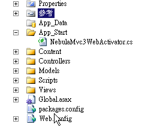

Nebula.Web.Mvc3
================

Asp.Net MVC 3.0 and later version provides a `DependencyResolver` method on IoC technique, which is used to create an instance of `Controller`. Hence there is a development difference between Asp.Net MVC 3.0 and Asp.Net MVC 2.0.

## Install
----------------

    Install-Package Nebula.Web.Mvc3

> Note: o not install with other Mvc Package (such as Nebula.Web.Mvc)

## WebActivator
----------------

After installing Nebula.Web.Mvc3, your project will create an `App_Start` folder, which contains a `NebulaMvc3WebActivator.cs` file. With the [WebActivator](https://github.com/davidebbo/WebActivator) technique, this program would be activated as the Application starts.



The generated WebActivator code is as the sample below:  

```csharp
[assembly: WebActivator.PostApplicationStartMethod(typeof(SaaS.Sample.Web.View.App_Start.NebulaMvc3WebActivator), "Init")]

namespace SaaS.Sample.Web.View.App_Start
{
    using System;
    using System.Linq;
    using System.Web.Mvc;

    public class NebulaMvc3WebActivator
    {
        /// <summary>
        /// Start PaaS.Web Mvc3 Application, Prepare IoC Container
        /// </summary>
        public static void Init()
        {
            DependencyResolver.SetResolver(new Quanta.PaaS.Web.Mvc.UnityDependencyResolver());
        }
    }
}
```

This code is created by [Transformation](http://docs.nuget.org/docs/creating-packages/configuration-file-and-source-code-transformations)of Nuget. The code namespace would be the same namespace of the project. This sample is for reference.  

## Multi-Tenancy
----------------

By modifing the `Global.asax.cs` setting, so Mvc can support [Multi-Tenancy](../MultiTenancy.md)

```csharp
// The routes.MapRoute method to routes.MapPaaSRoute method parameters unchanged.
routes.MapPaaSRoute(
    "Default", // Route name
    "{controller}/{action}/{id}", // URL with parameters
    new { controller = "Home", action = "Index", id = UrlParameter.Optional } // Parameter defaults
);
```
